# Курсовая работа 2021-2022

Разработка web-приложения с применением объектно-ориентированного подхода и языка C#, Entity Framework, PostrgeSQL и ASP.NET.

 

    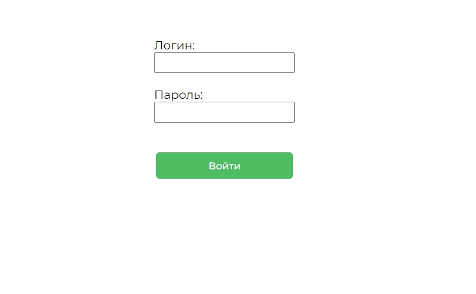

 

    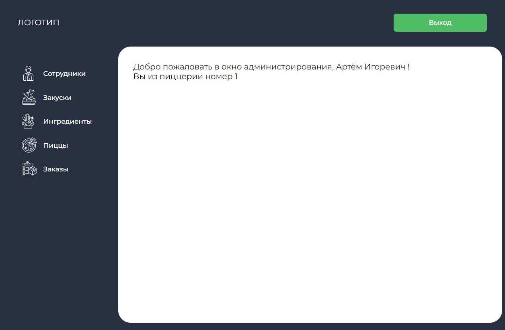

 

    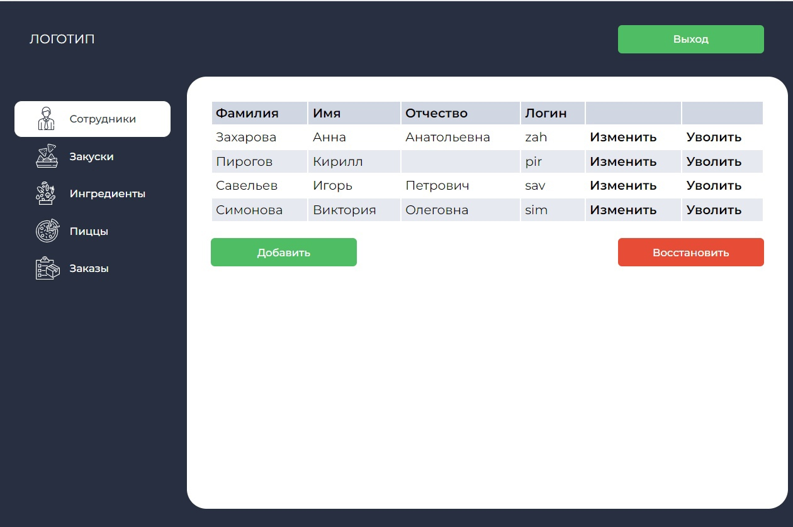

 

    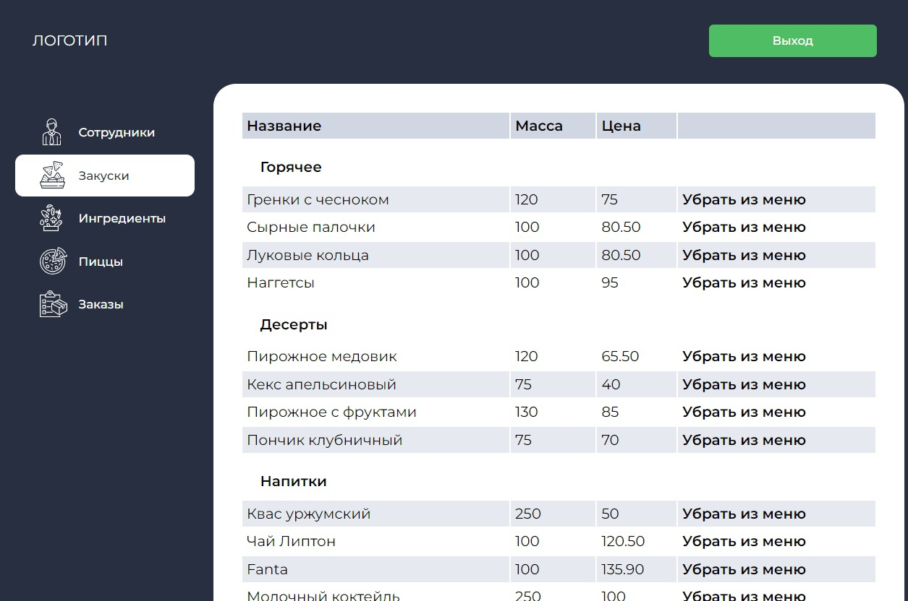

 

    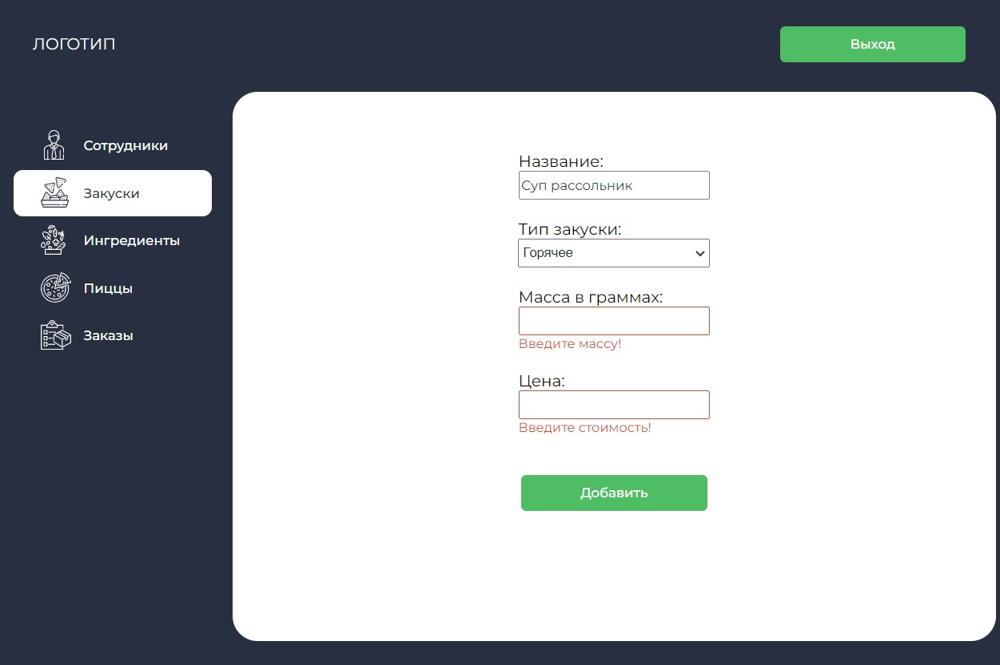

 

    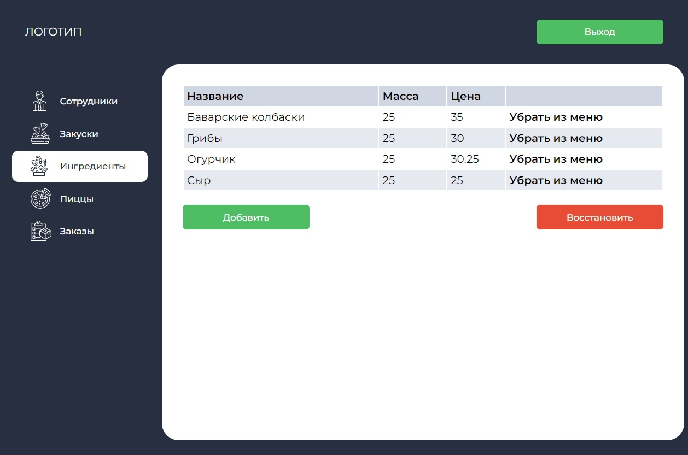

 

    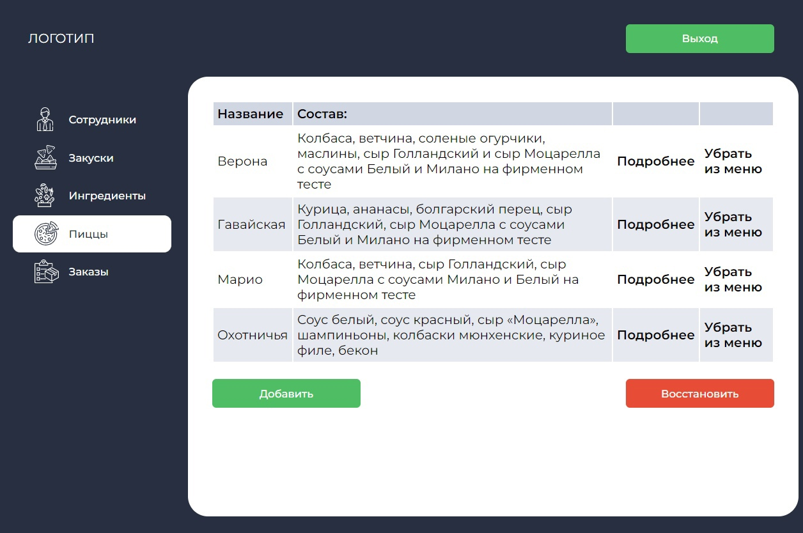

 

    

 

    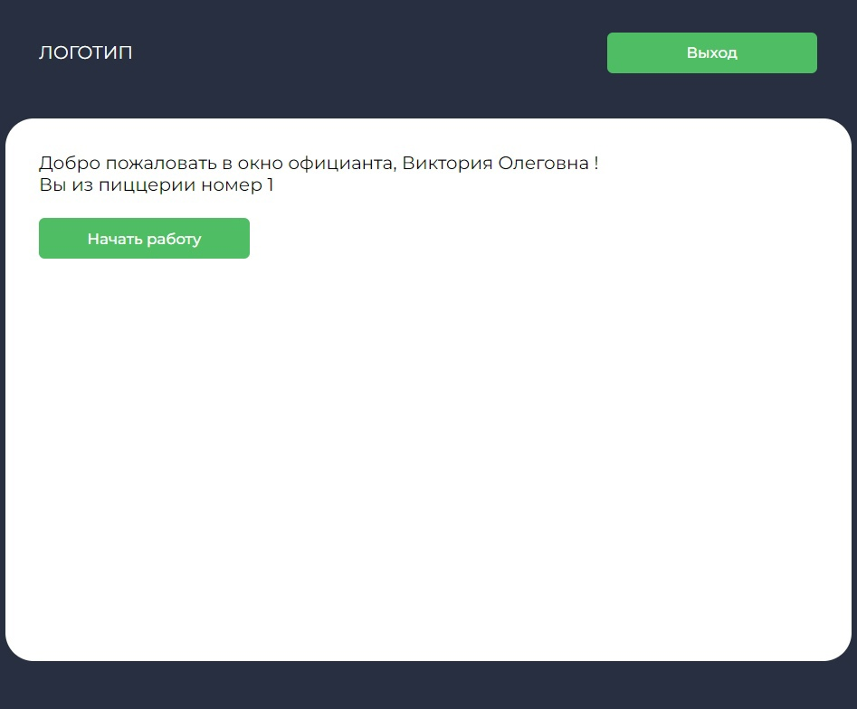

 

    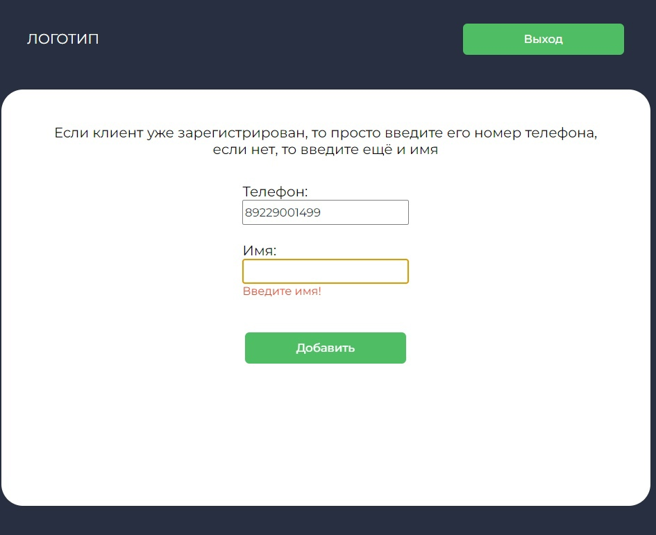

 

    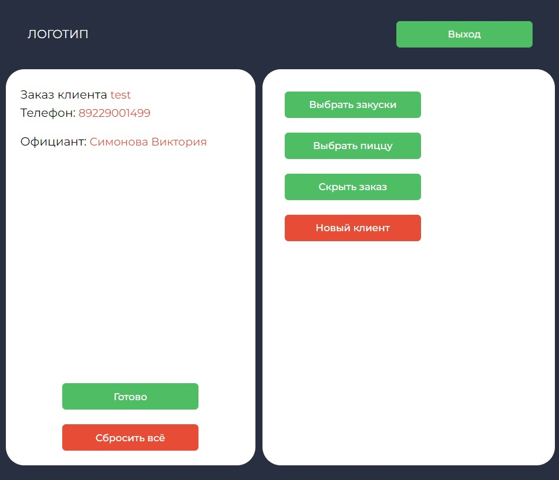

 

    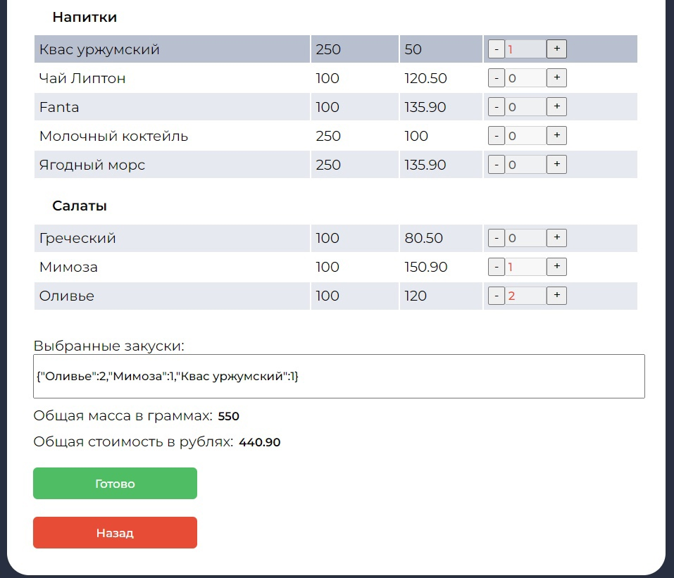

 

    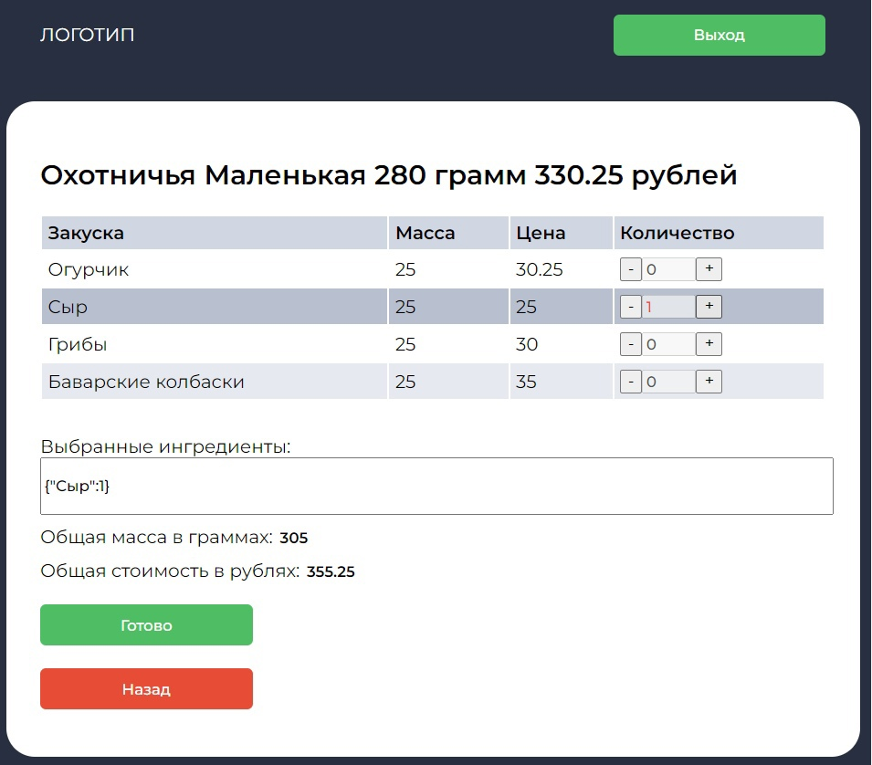

 

    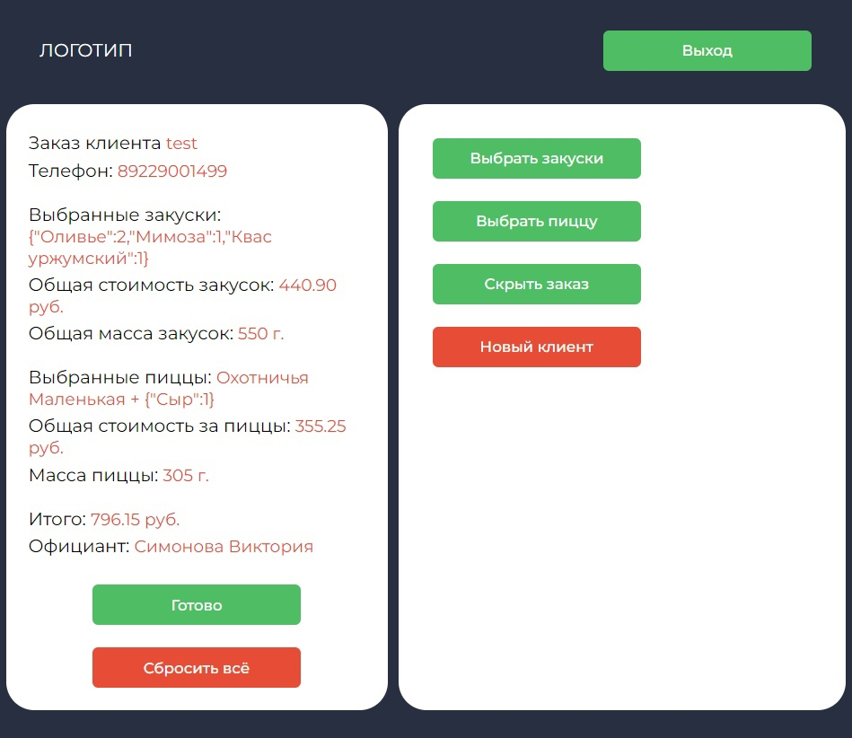

 

    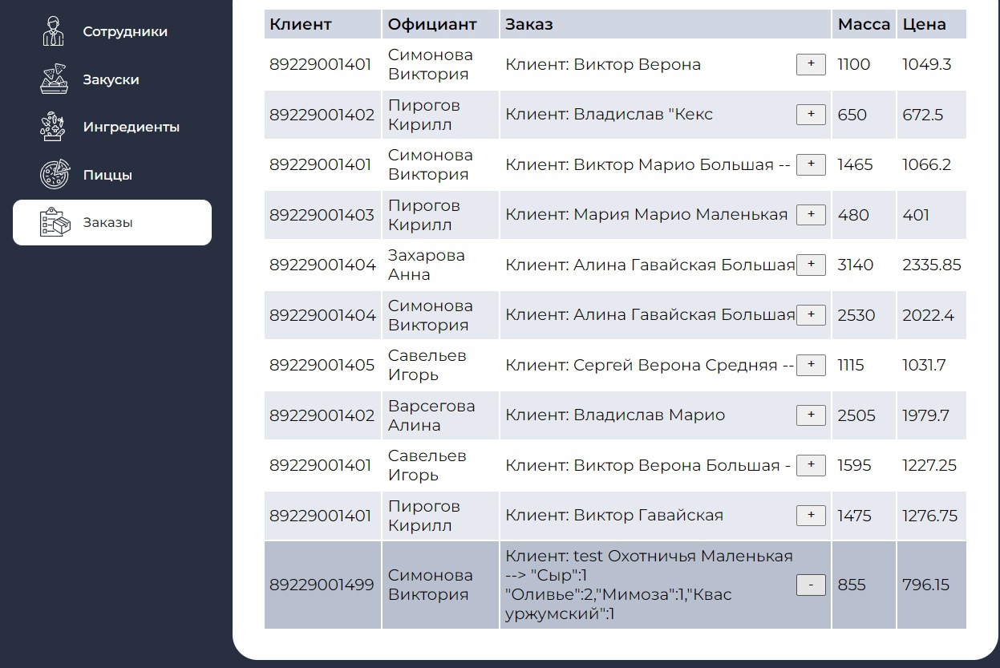

 
